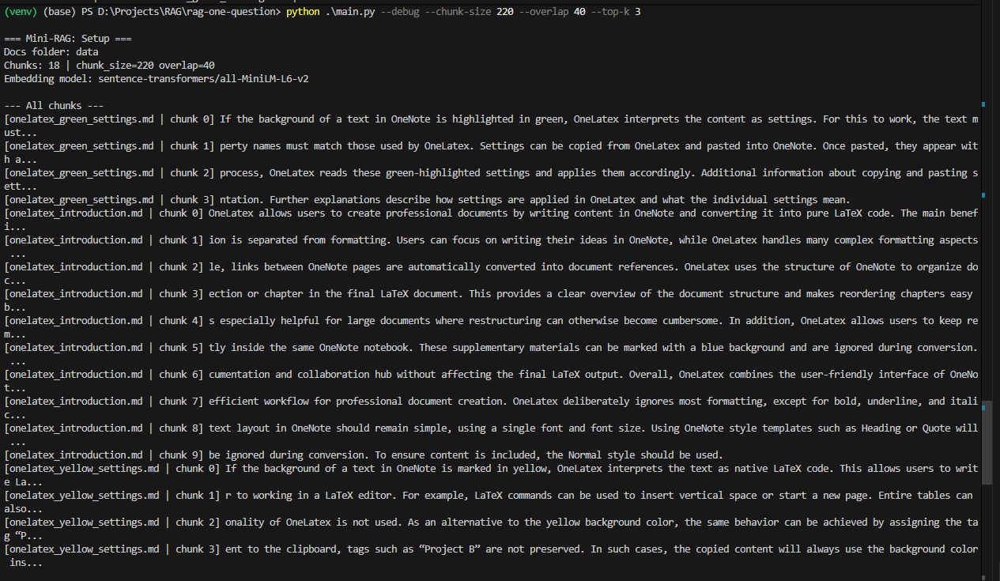
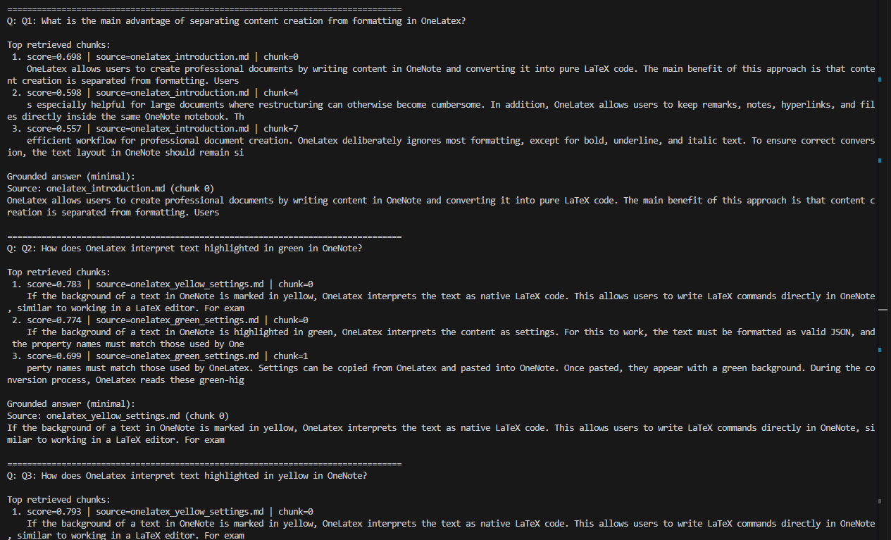
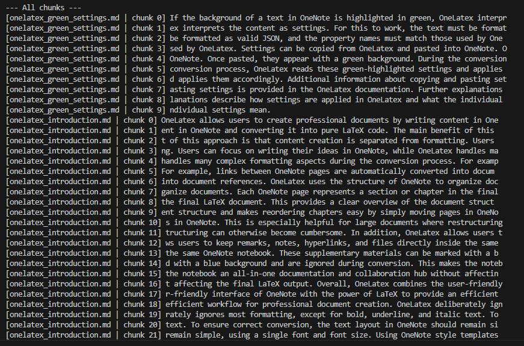
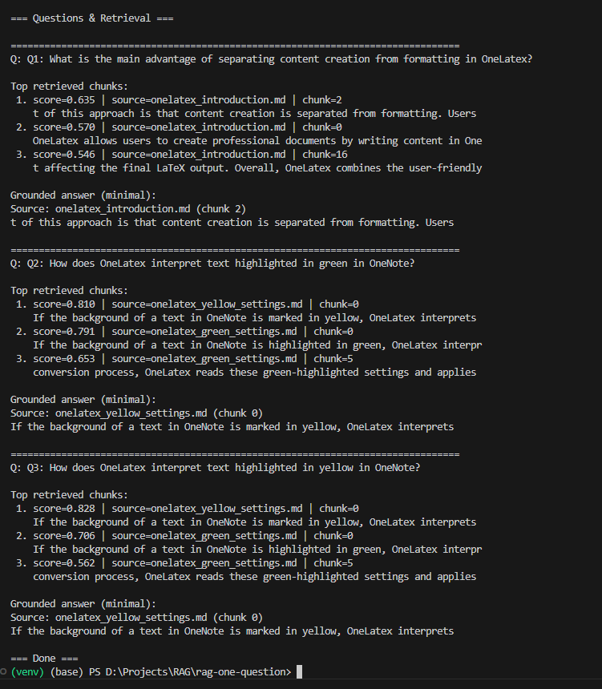
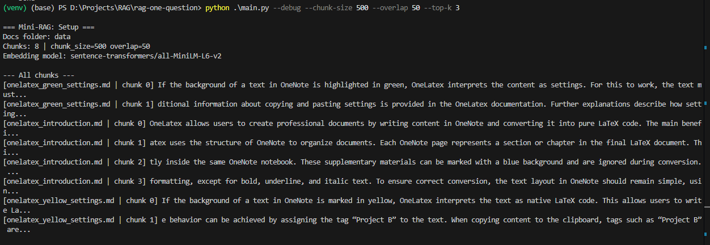
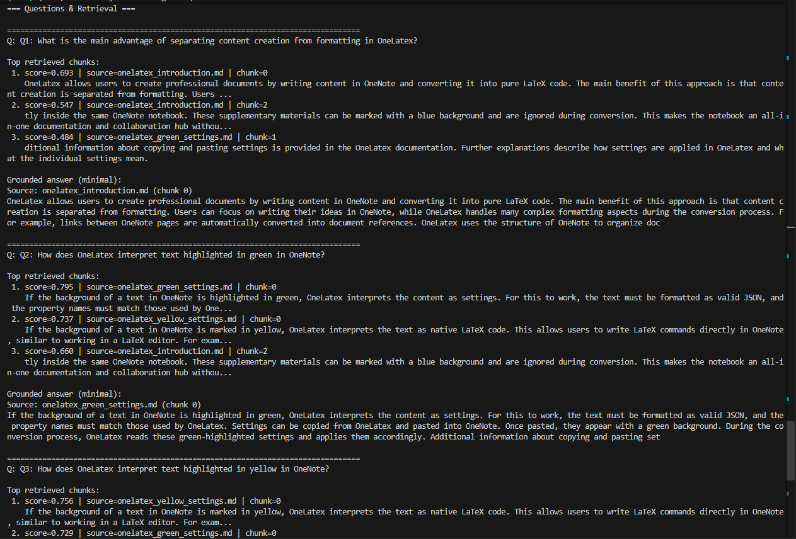

# Mini RAG Retrieval Experiment

A minimal Retrieval-Augmented Generation (RAG) setup that isolates and studies the **retrieval step** by treating **chunk size as an experimental variable**.

There is no chat history, no memory, and no LLM-based answer generation. The goal is to observe directly — and honestly — how chunking strategy affects what a sentence transformer can and cannot retrieve.

> Inspired by: [Chunk Size as an Experimental Variable in RAG Systems](https://towardsdatascience.com/chunk-size-as-an-experimental-variable-in-rag-systems/) — Towards Data Science

---

## What the Experiment Does

Three Markdown documents about a fictional tool called **OneLatex** serve as the knowledge base. OneLatex uses OneNote highlighting to carry semantic meaning:

| Highlight colour | Meaning in OneLatex |
|---|---|
| 🟢 **Green** | The highlighted text is interpreted as **JSON settings** to be applied during conversion. Settings can be copied from OneLatex and pasted back into OneNote. |
| 🟡 **Yellow** | The highlighted text is interpreted as **native LaTeX code** — commands are passed through directly, similar to writing in a LaTeX editor. Alternatively, the tag `"Project B"` achieves the same effect. |

These two concepts are semantically close (both relate to "how OneNote highlighting controls OneLatex behaviour") which makes them an ideal test case for retrieval sensitivity: a chunking strategy that produces chunks that are too small or too similar will cause the retriever to confuse them.

### Fixed Questions Asked in Every Run

```
Q1: What is the main advantage of separating content creation from formatting in OneLatex?
Q2: How does OneLatex interpret text highlighted in green in OneNote?
Q3: How does OneLatex interpret text highlighted in yellow in OneNote?
```

Q2 and Q3 are the critical pair — they probe whether the retriever can distinguish green (settings) from yellow (raw LaTeX).

---

## How to Run

```bash
pip install -r requirements.txt
```

```bash
# Experiment 1 – Baseline (medium chunks)
python main.py --chunk-size 220 --overlap 40 --top-k 3

# Experiment 2 – Small chunks
python main.py --chunk-size 80 --overlap 10 --top-k 3

# Experiment 3 – Large chunks
python main.py --chunk-size 500 --overlap 50 --top-k 3
```

| Argument | Description |
|---|---|
| `--chunk-size` | Maximum characters per chunk |
| `--overlap` | Character overlap between consecutive chunks |
| `--top-k` | Number of chunks to retrieve per question |
| `--data-folder` | Path to the folder containing `.md` files (default: `data/`) |
| `--model` | SentenceTransformer model (default: `all-MiniLM-L6-v2`) |
| `--debug` | Print all chunks before retrieval |

---

## Experiment Results

### Experiment 1 — Baseline · `chunk-size 220, overlap 40`

Medium-sized chunks produced visibly better results than small chunks. Most returned segments contained complete, self-sufficient explanations.

However, a subtle failure appeared precisely at **Q2 vs Q3** — the green/yellow distinction:

- When asking about **green** highlighting, the system returned the **yellow** chunk as Top-1.
- When asking about **yellow** highlighting, the system correctly returned the yellow chunk.

The two top candidates had very similar cosine similarity scores:

```
Top-1 score: 0.873   ← yellow chunk (wrong answer to Q2)
Top-2 score: 0.774   ← green chunk  (correct answer to Q2)
```

The model cannot reliably separate two thematically adjacent concepts at this chunk size. Because the system must commit to a single Top-1 result, it silently returns the wrong chunk — and the error is **invisible without score inspection**.

**Chunks produced:**



**Retrieval results:**



---

### Experiment 2 — Small Chunks · `chunk-size 80, overlap 10`

Very small chunks fragment the content into sentence fragments and isolated phrases. Individual segments no longer carry enough context to be self-contained.

Retrieval still finds thematically related fragments — the embedding similarity scores point in roughly the right direction — but the returned text is not usable as a standalone answer. The model finds the neighbourhood of the answer without finding the answer itself.

**Chunks produced:**



**Retrieval results:**



---

### Experiment 3 — Large Chunks · `chunk-size 500, overlap 50`

Larger chunks contain coherent, complete paragraphs. The additional context surrounding each concept gives the sentence transformer enough signal to clearly separate green (settings) from yellow (LaTeX code).

The Q2/Q3 confusion disappears entirely:

- The green-settings chunk is now correctly ranked Top-1 for Q2.
- The yellow-LaTeX chunk is correctly ranked Top-1 for Q3.
- The difference between the Top-1 and Top-2 similarity scores is **clearly wider**, making the ranking stable and interpretable.

The tradeoff: coarser chunks retrieve slightly more information than needed per question, and in documents with multiple interleaved topics per section this could introduce noise. For this experiment's three well-separated Markdown files the downside is negligible.

**Chunks produced:**



**Retrieval results:**



---

## Key Takeaways

| Chunk size | Fragmentation | Green/Yellow confusion | Score gap (Top-1 vs Top-2) |
|---|---|---|---|
| **80** (small) | High — sentence fragments | N/A (answers unusable) | Narrow / meaningless |
| **220** (medium) | Low — mostly complete | **Yes** — wrong Top-1 | 0.873 vs 0.774 (small gap) |
| **500** (large) | None | **No** — correctly distinguished | Clearly separated |

1. **Chunk size directly controls how much context each embedding carries.** Too little context and adjacent concepts become indistinguishable.
2. **Similarity scores are the diagnostic signal.** A small gap between Top-1 and Top-2 means the retriever is uncertain, even when a result looks plausible on the surface.
3. **There is no universally optimal chunk size.** For this corpus (three short, thematically separate files) 500 characters works well. For long, densely packed documents with multiple topics per section, the same setting could pull in irrelevant content.

---

## Stack

- [`sentence-transformers/all-MiniLM-L6-v2`](https://huggingface.co/sentence-transformers/all-MiniLM-L6-v2) — embedding model
- Cosine similarity via normalized dot product (`numpy`)
- Character-based chunking with configurable overlap
- No vector database, no LLM generation — pure retrieval only
